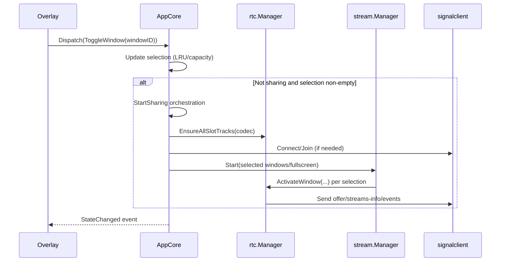
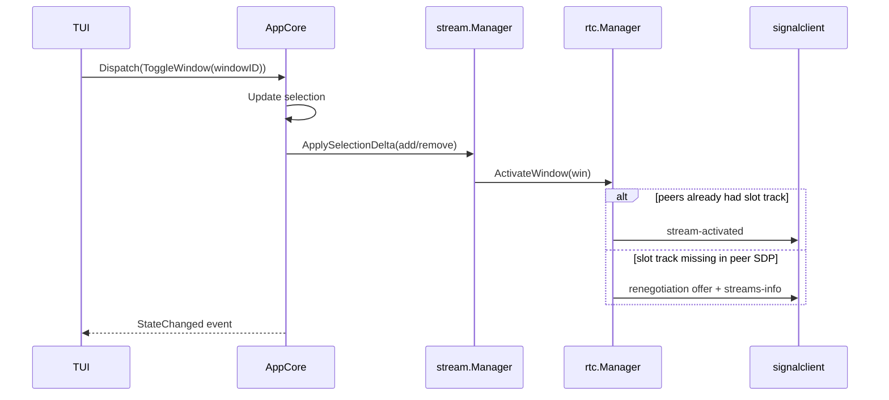
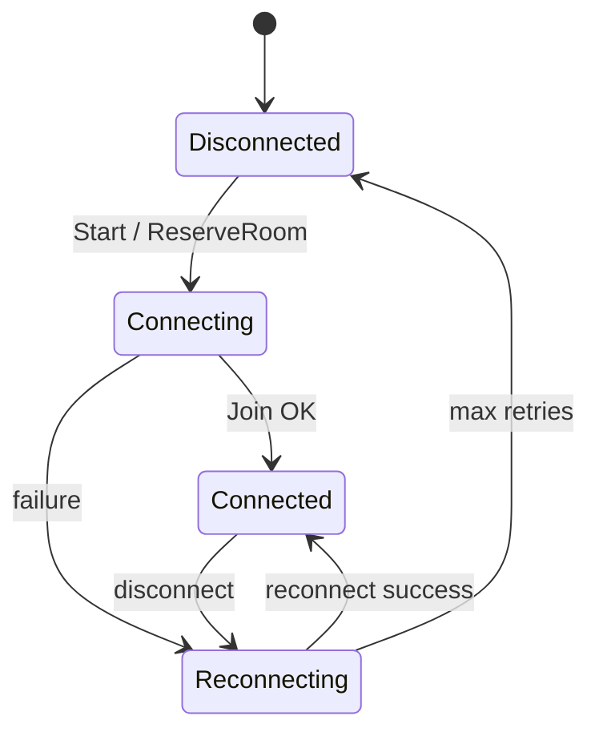

# GoPeep Refactor Plan (GPT)

**Author:** GPT
**Date:** 2026-01-11
**Updated:** After reviewing `REFACTORING_PLAN_CLAUDE.md`

This plan is deliberately detailed and implementation-oriented, intended to be usable as a handoff doc.

---

## Executive Summary

GoPeep currently has two "god files" (`tui.go`, `multistream.go`) and a "god object" Bubbletea `model` that owns UI state *and* core runtime services (signaling, WebRTC peer manager, streamer, overlay wiring).

This refactor introduces an **AppCore** (single owner of app state + services), makes **TUI and overlay thin views**, and makes **slot tracks (`video0..video3`) the single source of truth**. The work is structured in low-risk phases: first split files *without changing packages*, then extract AppCore, then slot-only cleanup, and finally move code into `internal/*` so repo root contains only `main.go`.

---

## 0) Goals, Constraints, and Principles

### Goals
- **Single owner** of runtime state and long-lived services (signaling, rtc, streaming).
- **Single source of truth** for tracks/streams: slot-based model.
- **Separation of concerns**: UI is view-only; core logic is elsewhere.
- **Navigability**: smaller files, clear directories, predictable dependencies.
- **Incremental safety**: each phase compiles and can be validated.

### Constraints
- macOS AppKit/overlay main-thread constraints must stay intact.
- Keep `cmd/server` functional and cross-platform.
- Avoid large behavior changes while moving code.

### Product/architecture decisions (from you)
1. Slots > track map; slots are canonical.
2. Support “add on the fly” *only* as a fallback (missing slot tracks in existing peers’ SDP).
3. Deactivate must never remove the 4 slot tracks.
4. Final structure: repo root should contain only `main.go`.

### Design principles (what a senior would enforce)
- **Unidirectional dataflow**: Views dispatch actions; core updates state; views render snapshots.
- **Event channels > callbacks** for state updates.
- Use `internal/*` to avoid exposing unstable APIs.
- Keep dependencies one-way (UI depends on core; core never depends on UI).

---

## 1) Current Codebase Map (Observed)

### Biggest files (LOC)
- `tui.go` ~2651 LOC (UI + selection + signaling connect/reconnect + streaming lifecycle)
- `multistream.go` ~2807 LOC (PeerManager + slots + Streamer + pipelines + stats)
- `capture_multi_darwin.go` ~1258 LOC (multi capture + focus/cursor helpers)

### Main issues
- Bubbletea `model` owns everything: UI state + selection + `wsConn`/`sharer` + `peerManager` + `streamer` + overlay.
- Ownership confusion: both `model` and `Streamer` hold the same `PeerManager` reference.
- `PeerManager` keeps redundant track state: `tracks map[...]` and `slots [4]*TrackSlot`.
- Overlay controller mirrors TUI state via manual `Sync(...)` copies; drift risk if a sync call is missed.

---

## 2) Target Architecture

### Components
- **AppCore**: owns state + services, provides `State()` and `Dispatch(Action)`.
- **TUI**: view-only Bubbletea model that renders core state snapshots and dispatches actions.
- **Overlay**: view-only; queries core state via an overlay controller implementation.
- **Services**: Signaling client, RTC/WebRTC manager, streaming manager, capture, encode.

### Component diagram
```mermaid
graph TD
  TUI[TUI (Bubbletea view)] -->|Dispatch(Action)| CORE[AppCore]
  OVL[Overlay (view)] -->|Dispatch(Action)| CORE

  CORE -->|State snapshot| TUI
  CORE -->|State snapshot| OVL

  CORE --> SIG[signalclient]
  CORE --> RTC[rtc.Manager]
  CORE --> STR[stream.Manager]
  STR --> CAP[capture]
  STR --> ENC[encode]
  RTC --> SIG
```

### Dependency rule diagram
```mermaid
graph LR
  UI[internal/ui/*] --> APP[internal/app]
  APP --> RTC[internal/rtc]
  APP --> STR[internal/stream]
  APP --> SIGC[internal/signalclient]
  STR --> CAP[internal/capture]
  STR --> ENC[internal/encode]
  APP --> LIM[internal/limits]
  STR --> LIM
  RTC --> LIM
  CAP --> LIM

  SIGP[pkg/signal] <-- SIGC
  OVL[pkg/overlay] <-- UI
```

---

## 3) Core Flow Examples (Sequence/State)

### A) Overlay click when not sharing (Quick Share)


### B) Dynamic add window while sharing


### Signaling connection state machine (simplified)


---

## 4) Final Folder/File Structure (End State)

Goal: repo root contains only the client `main.go`.

```text
gopeep/
  main.go

  internal/
    app/
      app.go            # AppCore lifecycle
      state.go          # StateSnapshot + derived helpers
      actions.go        # Action definitions
      selection.go      # selection rules + LRU eviction
      sharing.go        # start/stop orchestration
      events.go         # event channel + helpers

    ui/
      tui/
        model.go
        update.go
        view.go
        msgs.go
      overlaybridge/
        controller.go   # overlay.Controller backed by core
        events.go       # overlay event forwarding

    rtc/
      manager.go        # peers/offers/answers/ice
      slots.go          # slot tracks + Activate/Deactivate
      viewers.go

    stream/
      manager.go
      pipeline.go
      stats.go

    capture/
      types.go
      windows_darwin.go
      multi_darwin.go
      focus_darwin.go
      cursor_darwin.go
      stub.go

    encode/
      encoder.go
      factory.go
      vpx.go
      h264.go
      videotoolbox_darwin.go

    signalclient/
      client.go
      reserve.go
      reconnect.go

    limits/
      limits.go         # MaxCaptureInstances, etc.

  pkg/
    overlay/...
    signal/...
    settings/...

  cmd/
    server/
      main.go
```

---

## 5) AppCore API Sketch (Concrete)

### AppCore responsibilities
- Own selection state (windows/fullscreen, auto-share mode).
- Own and lifecycle-manage:
  - signaling client connection/reconnection
  - rtc manager
  - streaming manager
- Bridge events from rtc/stream/signaling into state updates.

### Suggested types
```go
// internal/app

type App struct {
    mu sync.RWMutex

    cfg ConfigSnapshot
    state State

    rtc *rtc.Manager
    stream *stream.Manager
    sig *signalclient.Client

    events chan Event
}

type Event struct {
    Type EventType
}

type State struct {
    RoomCode string
    RoomSecret string
    ShareURL string

    Selection Selection

    Sharing bool
    Starting bool
    LastError string

    ViewerCount int
    Streams []StreamSummary
}

type Selection struct {
    Fullscreen bool
    SelectedWindows map[uint32]bool
    AutoShareEnabled bool
    AutoShareFocusTimes map[uint32]time.Time
}

// Bubbletea/Overlay call this.
func (a *App) Dispatch(action Action) error
func (a *App) Snapshot() StateSnapshot
func (a *App) Events() <-chan Event
```

### Bubbletea integration pattern (wake UI on core events)
```go
// inside RunTUI() where you have `p := tea.NewProgram(...)`

go func() {
    for range app.Events() {
        p.Send(appStateChangedMsg{})
    }
}()
```

---

## 6) Slot-first Track Management (Detailed)

### The rule set
- Always 4 stable TrackIDs: `video0..video3`.
- New offers should include all slot tracks (preferred).
- If not all slot tracks were present for existing peers, activation triggers renegotiation.
- Deactivation never removes tracks from peers.

### Replace "legacy" with "lazy slot init + renegotiation"
We do not need dynamic TrackIDs.

### Proposed RTC API
```go
// internal/rtc

type ActivateResult struct {
    TrackID string
    SlotIndex int
    FastPath bool // true if peers already had this track
}

func (m *Manager) EnsureAllSlotTracks(codec CodecType) error
func (m *Manager) ActivateWindow(win capture.WindowInfo) (ActivateResult, error)
func (m *Manager) DeactivateTrack(trackID string) error
```

### Activation algorithm (pseudo)
```text
ActivateWindow(win):
  lock
  ensure all slot tracks exist (or at least the chosen slot)
  slot := first inactive slot
  slot.Active=true; slot.Info=win info
  if all peers already have sender for slot.TrackID:
    emit stream-activated
    return FastPath
  else:
    add missing senders
    renegotiate all peers (or just impacted ones)
    emit stream-activated
    return SlowPath
```

### Deactivation algorithm (pseudo)
```text
DeactivateTrack(trackID):
  lock
  slot := find slot by TrackID
  slot.Active=false; slot.Info=nil
  emit stream-deactivated
  // DO NOT remove sender/track from peer
```

---

## 7) Implementation Phases (Incremental, with Deliverables)

This is ordered for lowest risk first, then architecture changes.

### Phase 0 — Baseline
- Run `go test ./...` and `go vet ./...`.
- Confirm the manual run path still works.

### Phase 1 — Split `multistream.go` (no logic changes, same package)
Create new files (still `package main`):
- `peer_manager.go`: `PeerManager`, negotiation, peer state.
- `track_slots.go`: `TrackSlot`, init/recreate/activate/deactivate helpers.
- `streamer.go`: `Streamer` orchestration.
- `pipeline.go`: `StreamPipeline` run/stop loops.
- `multistream_types.go`: shared types.

Acceptance:
- Only code movement.
- Build + tests still pass.

### Phase 2 — Split `tui.go` (no logic changes, same package)
Create files (still `package main`):
- `tui_model.go`, `tui_update.go`, `tui_view.go`
- keep signaling and streaming glue in their own files temporarily (`tui_signaling.go`, `tui_streaming.go`) to isolate later extraction.

Acceptance:
- Only movement.
- UI behavior unchanged.

### Phase 3 — Introduce `AppCore` (ownership change)
- Create `AppCore` (initially still in `package main` for minimal churn).
- Move selection, signaling, streaming ownership out of Bubbletea model.
- Implement event channel and Bubbletea wake-up goroutine.

Acceptance:
- Bubbletea model holds UI-only fields + `core *AppCore`.

### Phase 4 — Overlay controller queries core directly
- Replace `OverlayController.Sync(...)` with `OverlayController{core *AppCore}`.
- Remove `syncOverlay()` calls.
- Overlay events dispatch actions to core.

Acceptance:
- Overlay can’t drift; it reads live state.

### Phase 5 — Slot-only cleanup + Activate/Deactivate semantics
- Remove `tracks map[...]` redundancy.
- Replace branching `AreSlotsReady` + legacy add/remove with slot-first API.
- Make deactivation always slot-based (never remove tracks).

Acceptance:
- Adding/removing windows works.
- Renegotiation occurs only when required.

### Phase 6 — Move code into `internal/*` and leave root with only `main.go`
- Move AppCore → `internal/app`.
- Move UI → `internal/ui/*`.
- Move rtc/stream/capture/encode/signalclient into internal packages.
- Add `internal/limits` and use it everywhere.

Acceptance:
- Root has only `main.go`.
- `go build -o gopeep .` works.

### Phase 7 — Unit tests
- Add tests for selection and slot invariants.

---

## 8) Verification Checklist (Manual)

After each phase (especially 3–6):
- Start app, get room code.
- Select a window → sharing starts.
- Add/remove windows while sharing.
- Toggle fullscreen.
- Change codec + FPS.
- Kill signal server (or disconnect network) → reconnection loop doesn’t freeze UI.
- Inspect `gopeep-debug.log`.

---

## Appendix A — File Move Matrix (End State)

This is a suggested mapping; implementer may adjust names.

- Root `package main` → internal packages:
  - `capture_darwin.go`, `capture_multi_darwin.go` → `internal/capture/*_darwin.go`
  - `encoder*.go`, `codec.go`, `quality.go`, `fps.go` → `internal/encode/*`, `internal/quality/*`
  - `multistream*.go` split files → `internal/rtc/*`, `internal/stream/*`
  - `tui*.go` split files → `internal/ui/tui/*`
  - `overlay_controller.go` → `internal/ui/overlaybridge/controller.go`
  - signaling glue from `main.go`/TUI → `internal/signalclient/*` and `internal/app/*`

---

## Definition of Done
- Slot tracks are the only stream state store.
- Deactivation never removes tracks.
- TUI/overlay are thin views.
- Root directory contains only `main.go`.
- `go test ./...` and `go vet ./...` pass.
